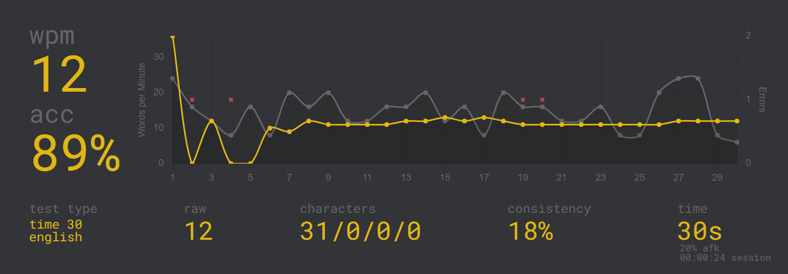
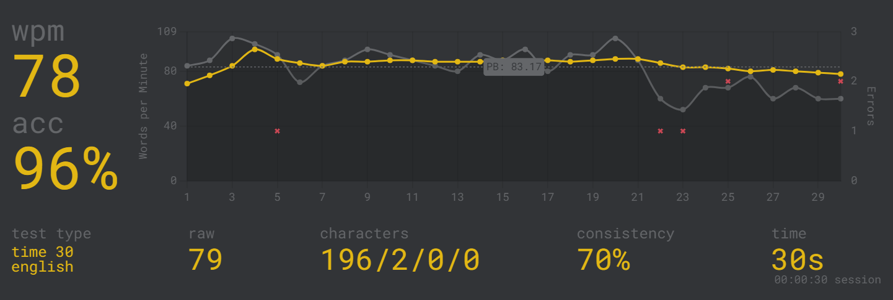

# Lily58

## Build

To build my Lily58 I mainly used this build guide: [https://github.com/kata0510/Lily58/blob/master/Pro/Doc/buildguide_en.md](https://github.com/kata0510/Lily58/blob/master/Pro/Doc/buildguide_en.md).

The most important part to look out for is which parts are mounted on which side, and to not confuse them.
Both PCBs are identical and can be used in both directions, however by building it you commit to use it for one of the sides.
The diodes and the Hotswap sockets (only if you have the Hotswap version obviously) are mounted on the back/bottom side, everything else gets mounted on the front side.

## Install QMK

To install QMK, I followed [this](https://docs.qmk.fm/#/getting_started_build_tools) and [this](https://kriscables.com/lily58-build-guide/) documentation.

I used a Ubuntu-VM for this, which I passed the Arduino through to.

First, update your system and install pip:

```zsh
sudo apt update
sudo apt upgrade
sudo apt install -y git python3-pip
```

Install qmk:

```zsh
python3 -m pip install --user qmk
```

Add local pip folder to `$PATH` (only required when you get a "command not found", which might happen on current Ubuntu and Debian derivatives):

Zsh:

```zsh
echo 'PATH="$HOME/.local/bin:$PATH"' >> $HOME/.zshrc && source $HOME/.zshrc
```

Bash:

```bash
echo 'PATH="$HOME/.local/bin:$PATH"' >> $HOME/.bashrc && source $HOME/.bashrc
```

Start the qmk setup:

```zsh
qmk setup cvonderstein/qmk_firmware
```

Here, you might want to use your own fork of the qmk firmware.
For that, replace "cvonderstein" with your GitHub Username.

If you do not know what a fork is or just don't want to do these extra steps, you can just run `qmk setup`.

This command will also ask to install dependencies which are required to compile and flash QMK to your Arduino.

Afterwards, you can run

```zsh
qmk compile -kb lily58/rev1 -km default
```

to compile QMK with a keymap that fits the Lily58.
After compiling, you run

```zsh
qmk flash -kb lily58 -km default -bl avrdude
```

to flash the compiled image.
While flashing, the utility asks you to press the reset button (or connect the `RST` and `GND` Pins), which sets the Arduino into a programming mode, that allows to flash the software onto it.

This should be it for the flashing part.

Just as a Note: The two Arduinos assume (at least by default) assume the one which has the USB cable plugged in to be the left hand.
I'm very new to QMK, so I don't know if this can be changed easily but I assume it can be.

# Well...

For every letter thats not written on the keycaps, this image will become your best friend for the next days, weeks, ... I don't know :)


This keyboard takes some getting used to, this is my first typing test on monkeytype:



While this is a random test I did directly after with a normal keyboard:


